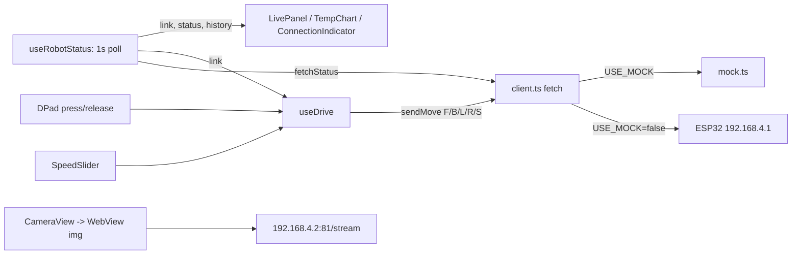

# Tacover — project guide

Reference notes for the repo in `C:/Users/User/Projects/Tacover`.
Everything below was read out of the source, not from memory. Line/file references are exact.

---

## 1. What this is

**Tacover** is a phone app that acts as the remote control + dashboard for a Wi-Fi robot car.
It is *only* the client — there is no ESP32 firmware in this repo, only the contract the
firmware must satisfy.

One screen, two layouts:

| Panel | What it does |
| --- | --- |
| Header | brand, `MOCK` badge when mock mode is on, connection pill |
| Camera | MJPEG live feed (Android reliably, iOS hit-or-miss) |
| Telemetry | temperature / humidity / obstacle distance |
| Temperature trend | hand-drawn SVG line chart of the last 60 readings |
| Speed | 0–255 slider, `PanResponder` based, no dependency |
| D-pad | hold-to-drive; release / background / link loss all stop the car |
| Warning banner | appears at ≤ 15 cm |

Landscape is the intended orientation (camera+speed | telemetry | D-pad); portrait stacks the
same panels in a scroll column (`App.tsx:71-131`).

---

## 2. What it mainly uses

From `package.json`:

| Package | Version | Role |
| --- | --- | --- |
| `expo` | `~57.0.26` | Expo SDK 57 toolchain / Expo Go |
| `react-native` | `0.86.3` | native runtime |
| `react` | `19.2.3` | UI |
| `typescript` | `~6.0.3` | language; `tsc --noEmit` typechecks |
| `react-native-svg` | `15.15.4` | D-pad chevrons, temperature chart |
| `react-native-webview` | `13.16.1` | MJPEG camera feed |
| `react-native-safe-area-context` | `~5.7.0` | notches / gesture bars |
| `expo-build-properties` | `~57.0.22` | sets `usesCleartextTraffic: true` on Android |
| `expo-status-bar` | `~57.0.1` | light status bar |

Notes:

- **No navigation library.** `AGENTS.md` prescribes Expo Router, but this app is a single
  screen and does not use it — there is no `src/app/` directory and no `expo-router` dep.
- **No state library, no HTTP library, no slider/chart library.** State is `useState`/`useRef`
  in hooks; HTTP is `fetch` + `AbortController`; slider and chart are hand-rolled.
- **Web target is installed but has no WebView.** `react-dom`, `react-native-web` and
  `@expo/metro-runtime` are present, so `npm run web` runs the whole HUD in a browser;
  `react-native-webview` has no web implementation, so `src/components/CameraView.web.tsx`
  (a platform-specific module Metro picks on web) draws the stream with a plain ``.
- Plain-HTTP to a local device: `app.json` sets the Android cleartext flag via
  `expo-build-properties` and an iOS `NSAppTransportSecurity` exception, plus
  `NSLocalNetworkUsageDescription` (iOS 14+ local-network prompt text).

---

## 3. Architecture / file map

```
index.ts                     registerRootComponent(App)
App.tsx                      orientation-aware layout + wiring of hooks to panels
app.json                     Expo config: orientation, cleartext, bundle ids, iOS ATS
eas.json                     EAS build profiles (preview = APK, production = AAB)
src/config.ts                *** every address, tunable, and wire-format name ***
src/theme.ts                 palette, mono/sans fonts, glow() helper, eyebrow style

src/robot/
  types.ts                   MoveDir ('F'|'B'|'L'|'R'|'S'), RobotStatus, parseStatus()
  client.ts                  fetchStatus() / sendMove(); timeouts; never throws
  mock.ts                    random-walk fake telemetry, MOCK_FAILURE_RATE, latency
  camera.ts                  buildStreamHtml() — the page loaded into the WebView

src/hooks/
  useRobotStatus.ts          1 s /status poll, link state, 60-sample temp history
  useDrive.ts                hold-to-repeat driving + every safety stop

src/components/
  DPad.tsx  SpeedSlider.tsx  CameraView.tsx  LivePanel.tsx  TempChart.tsx
  WarningBanner.tsx  ConnectionIndicator.tsx  Panel.tsx  StarField.tsx
  CameraView.web.tsx         web-only camera panel (Metro platform resolution)
```

Data flow:



---

## 4. The hardware contract (what the ESP32 must speak)

All of this is defined in `src/config.ts` and nowhere else.

```
GET http://192.168.4.1/move?dir=F|B|L|R|S&speed=0-255     # port 80 implied
GET http://192.168.4.1/status
      -> {"temp":<number>,"humidity":<number>,"distance":<number>}   # °C, %, cm
GET http://192.168.4.2:81/stream                           # multipart/x-mixed-replace MJPEG
```

- `dir=F` forward, `B` back, `L` left, `R` right, `S` stop.
- While a button is held the command is **resent every 100 ms** (`REPEAT_INTERVAL_MS`);
  the firmware therefore only needs to latch the last command — it does not need a
  watchdog, though a dead-man timeout on the firmware side is still good practice.
- `/status` is polled every 1000 ms with a 2000 ms timeout; 2 consecutive failures flip the
  link to `offline` (`FAILURES_BEFORE_OFFLINE`), which locks out the D-pad and force-sends `S`.
- Field/param **names** are remappable without touching any other file: `STATUS_FIELDS` and
  `MOVE_PARAMS` in `src/config.ts`. Endpoint *paths* are built in the same file
  (`MOVE_URL`, `STATUS_URL`, `CAMERA_STREAM_PATH`).
- `parseStatus()` (`src/robot/types.ts:20-45`) accepts numbers **or numeric strings**, and
  returns `null` for a malformed payload so a firmware change shows as "Unexpected /status
  payload" instead of `NaN` on screen.

---

## 5. Configuration — every knob

`src/config.ts` is the single source of truth.

| Setting | Default | Meaning |
| --- | --- | --- |
| `USE_MOCK` | `true` | fake all robot I/O, no network |
| `ROBOT_IP` / `ROBOT_PORT` | `192.168.4.1` / `80` | drive + telemetry board |
| `CAMERA_IP` / `CAMERA_PORT` | `192.168.4.2` / `81` | MJPEG host |
| `CAMERA_STREAM_PATH` | `/stream` | MJPEG path |
| `MIN_SPEED` / `MAX_SPEED` / `DEFAULT_SPEED` | 0 / 255 / 150 | slider range |
| `REPEAT_INTERVAL_MS` | `100` | resend cadence while held |
| `STATUS_POLL_MS` | `1000` | `/status` cadence |
| `STATUS_TIMEOUT_MS` | `2000` | slow answer = failure |
| `MOVE_TIMEOUT_MS` | `800` | *defined and imported but unused — see §9* |
| `FAILURES_BEFORE_OFFLINE` | `2` | failed polls before red link |
| `OBSTACLE_WARNING_CM` | `15` | red banner threshold |
| `HISTORY_SIZE` | `60` | chart samples |
| `STATUS_FIELDS` | `temp` / `humidity` / `distance` | JSON key mapping |
| `MOVE_PARAMS` | `dir` / `speed` | query-param mapping |

There is **no settings screen in the app** — no `TextInput`/form exists anywhere in the
source. Configuration = edit the file, then restart Metro with a cleared cache:

```bash
npx expo start -c        # PowerShell: npx.cmd expo start -c
```

---

## 6. Running it

```bash
npm install
npx expo start           # a = Android emulator, i = iOS simulator, w = browser, QR = Expo Go
npx tsc --noEmit         # typecheck
npx expo lint            # lint
```

Mock mode is on out of the box, so a first run needs no hardware. To exercise failure paths,
set `MOCK_FAILURE_RATE` in `src/robot/mock.ts` above `0`.

Release/field APK:

```bash
npx eas-cli@latest build -p android --profile preview   # eas.json: buildType "apk"
```

---

## 7. Can it connect to an iPhone?

**Yes.** `react-native-webview` is bundled inside Expo Go for iOS (`inExpoGo: true`,
platforms `android`/`ios`/`expo-go` — Expo SDK 57 docs), and every other dependency is either
JS-only or also bundled. So iOS *development* needs no custom dev build:

1. Install **Expo Go** from the App Store on the iPhone.
2. Start Metro on the laptop, scan the QR code.
3. iOS 14+ will show a **Local Network** permission prompt the first time the app talks to
   `192.168.4.x` — allow it. (In Expo Go the prompt text is Expo's; in an `eas build` of this
   repo it is the `NSLocalNetworkUsageDescription` string in `app.json`.)

iOS caveats that are real, not theoretical:

- **Camera feed.** MJPEG is `multipart/x-mixed-replace`. Chromium (Android) renders it
  reliably; **WKWebView on iOS is inconsistent** with multipart streams. `CameraView.tsx` +
  `src/robot/camera.ts` handle this: the stream goes into an `` inside a WebView document
  (not the WebView's `source` URL, which cannot do multipart), and if no frame decodes within
  8 s the panel shows the stream URL plus a **Retry** button instead of a blank rectangle.
  Expect iOS to need Retry sometimes; the rest of the app (drive + telemetry) is unaffected.
- **Metro over the robot's AP.** The ESP32's AP has no internet. If the phone is joined to it,
  it cannot reach the Metro dev server (and `--tunnel` needs internet, so it will not help).
  Two workarounds: put the **laptop on the same ESP32 AP** and serve Metro over that LAN
  (`npx expo start --host lan`), or — better for field use — install a **baked-in build** so no
  dev server is needed at runtime.
- **Installing an iOS build on a real device** needs an Apple Developer account ($99/yr) and
  registered device UDIDs or TestFlight; an iOS Simulator needs a Mac. Android is the
  frictionless path (`preview` profile produces a directly installable APK).

Recommended field setup either way: `eas build` once, install, then the only network the phone
needs is the robot's AP.

---

## 8. Seeing / configuring it from the laptop

Three options:

**A. Android emulator.** Requires an Android SDK + AVD (`ANDROID_HOME`). Not installed on
this machine: `ANDROID_HOME` is unset, `%LOCALAPPDATA%\Android` does not exist, no Android
Studio — so `npx expo start` → `a` fails with *"Failed to resolve the Android SDK path"* and
*"'adb' is not recognized"*. Install Android Studio (multi-GB) if you want this path.
Once it exists: `npx expo start` → `a`.
- Mock mode works fully.
- With `USE_MOCK = false` **and the laptop joined to the ESP32's AP**, the emulator reaches
  `192.168.4.1` through the host's network, so you can drive/test the real car from the laptop.
- The camera uses the emulator's WebView (Chromium), so MJPEG usually renders.

**B. Browser on the laptop (no SDK install needed).**
```bash
npm run web        # = npx expo start --web; opens http://localhost:8081
```
The web dependencies (`react-dom`, `react-native-web`, `@expo/metro-runtime`) and a web camera
panel (`src/components/CameraView.web.tsx`) are wired up, so the whole HUD runs in Chromium —
mock mode included. Verified on this machine: mock camera panel, live telemetry, temperature
chart, speed slider, hold-to-drive (`dir=F` immediately then every 100 ms, `dir=S` on release),
and both camera states (`playing` with a live MJPEG source, `error` + Retry when it is down).
Browser caveat when talking to the **real** robot: browsers enforce CORS, so `GET /status`
fails unless the firmware sends `Access-Control-Allow-Origin: *`; the `/move` request still
reaches the device (only its response is unreadable). [INFERENCE — cannot be tested without
hardware; mock mode has no network at all.] So use the browser for UI work and mock driving,
and a phone/emulator for real telemetry.

**C. Mirror the phone.** Run it on the real phone (Expo Go) and mirror the screen to the
laptop: `scrcpy` (Android, USB/Wi-Fi) or QuickTime "Movie Recording" (iPhone, Mac). Input is
still on the laptop.

**Configuring** is always editing `src/config.ts` (plus `src/robot/mock.ts` for failure
injection) and restarting Metro with `-c`. If you want an in-app settings screen later, that is
a new feature — nothing in the repo does it today.

---

## 9. Linking to the real ESP32 when the parts arrive

The app already speaks plain HTTP to two hosts on the robot's Wi-Fi network. `192.168.4.1` is
the ESP32 SoftAP default gateway address, so an AP-mode ESP32 firmware lands there by default
[INFERENCE from the address choice; verify against your firmware].

### Firmware must expose

1. HTTP server on port 80, endpoints `/move` and `/status` exactly as in §4, JSON body only.
2. MJPEG server on port 81 at `/stream` (a separate ESP32-CAM board, or another interface).
3. `Content-Type: multipart/x-mixed-replace; boundary=...` on the stream, and the usual
   `Content-Type: image/jpeg` parts.

### Steps

1. Flash the firmware; confirm the robot's AP SSID and the two IPs (serial monitor).
2. From a laptop **on that AP**, verify before touching the app:
   ```bash
   curl http://192.168.4.1/status
   curl "http://192.168.4.1/move?dir=F&speed=150"
   curl "http://192.168.4.1/move?dir=S&speed=0"
   curl -v http://192.168.4.2:81/stream     # expect multipart/x-mixed-replace
   ```
3. Edit `src/config.ts`: `USE_MOCK = false`; fix `ROBOT_IP`/`ROBOT_PORT` and
   `CAMERA_IP`/`CAMERA_PORT` if firmware differs.
4. If the firmware's JSON keys differ, change `STATUS_FIELDS` only
   (e.g. `temperature: 'temperature'`).
5. Restart with a cleared cache: `npx expo start -c`.
6. Watch the header pill: `Syncing` → `Linked` green means `/status` is parsed and sane. The
   pill prints the actual error string (`Network unreachable`, `No answer in 2s`, `HTTP 404`,
   `Malformed JSON`, `Unexpected /status payload`) — that string is your debugging breadcrumb.
7. Drive: the D-pad is locked until the link is green (`drive.enabled`).

### Wiring notes

- Two IPs are assumed. A single board serving both control and camera still works: point both
  `ROBOT_IP` and `CAMERA_IP` at the same host and adjust ports/paths.
- `speed` is 0–255 and is clamped in `client.ts` before it hits the wire.
- Keep the firmware tolerant of a *stream* of identical `dir` values — that is what hold-to-drive
  produces (10 requests/second while held).
- Android release builds would block cleartext HTTP without the `expo-build-properties` plugin
  in `app.json`; it is already configured, so nothing to add.

---

## 10. Programming concepts used here

**Main one: cancellation tokens via a generation counter — cancelling an async loop without
`clearInterval`.**

`useDrive.ts` runs a repeating loop while a direction is held (resend every 100 ms). It never
stores a timer handle. Instead `loopRef` is an ever-increasing integer; each loop instance
captures the generation it started in and refuses to continue if the counter has moved on:

```ts
const stop = () => { loopRef.current += 1; ... };           // invalidates any running loop
const press = (dir) => {
  loopRef.current += 1;
  const generation = loopRef.current;
  const repeat = () => {
    if (loopRef.current !== generation) return;             // stale → die silently
    if (activeRef.current !== null) sendMove(activeRef.current, speedRef.current);
    setTimeout(repeat, REPEAT_INTERVAL_MS);
  };
  setTimeout(repeat, REPEAT_INTERVAL_MS);
};
```

Why it matters: a scheduled `setTimeout` callback cannot be "un-scheduled" from the future, and
a captured variable would be a *stale closure* (it would see the old `active`/`speed`). Bumping
a counter and re-reading `ref`s makes every stale tick a no-op instead of a race, and makes
stop/re-press idempotent. This is the same idea as a cancellation token / `AbortController`
generation in async code.

Related concepts also present, each with a concrete use:

- **Discriminated-union result types instead of exceptions.** `StatusResult = {ok:true;status} |
  {ok:false;error}` (`client.ts:14`). `getJson` catches everything — including `AbortError` from
  `AbortController` — and returns a reason, so a dead robot can never crash the UI.
- **Self-scheduling loop instead of `setInterval`.** `useRobotStatus.ts:31,47` schedules the next
  poll *after* the current one settles, so a hung robot cannot pile requests up; `cancelled`
  flags the unmount.
- **Refs to bridge React state and callbacks.** `useDrive` mirrors `speed`/`link`/`active` into
  refs so the event handlers and loops always read current values without re-creating callbacks
  (`speedRef.current = speed` on every render).
- **Optimistic UI / safety stop as policy.** A stop is sent on release, on `AppState !== 'active'`,
  on link `offline`, and on unmount — four independent paths, so no single missed event can leave
  the car driving.
- **Backpressure / in-flight dedupe.** `client.ts:63` keeps a module-level `inFlight` direction
  and skips re-sending the same direction while the previous request is still open.
- **WebView ↔ native `postMessage` bridge.** `src/robot/camera.ts` injects a page whose `<script>`
  polls `img.naturalWidth` and posts `{type:'playing'|'error'}` back to RN; also an 8-second
  watchdog. `CameraView.tsx` memoizes the `source` object so the WebView is not reloaded each
  render.
- **Deterministic PRNG for stable decoration.** `StarField.tsx` uses `mulberry32(0x5eed1a)` so
  the star map is identical across launches and platforms (no `Math.random()` in render).
- **Config-as-contract.** Addresses, timings, and wire-format names live in one module, so
  firmware renames never leak into parsing, mocking, or the UI.

---

## 11. Known rough edges

Factual notes from reading the source, worth knowing before the hardware arrives:

1. `MOVE_TIMEOUT_MS` (`config.ts:53`) is exported and imported by `client.ts:5` but **never
   used** — `sendMove` fires `fetch` with no timeout, unlike `getJson`. Consequence: if a
   `/move` request hangs without settling, `inFlight` stays set to that direction, and the next
   press of the *same* direction is silently dropped (`client.ts:70`) until the socket resolves.
   Pressing another direction (e.g. `S`) still goes through immediately.
2. The camera on iOS may require tapping **Retry** (WKWebView + multipart MJPEG); Android is
   reliable. Telemetry and driving are unaffected.
3. No runtime configuration UI, no persistence (speed resets to `DEFAULT_SPEED` on relaunch),
   no navigation — the repo's `AGENTS.md` routing guidance refers to a multi-screen structure
   this app does not have yet.
4. Mock mode is the default (`USE_MOCK = true`); forgetting to flip it looks exactly like a
   working robot, except the header shows the purple `MOCK` badge.
